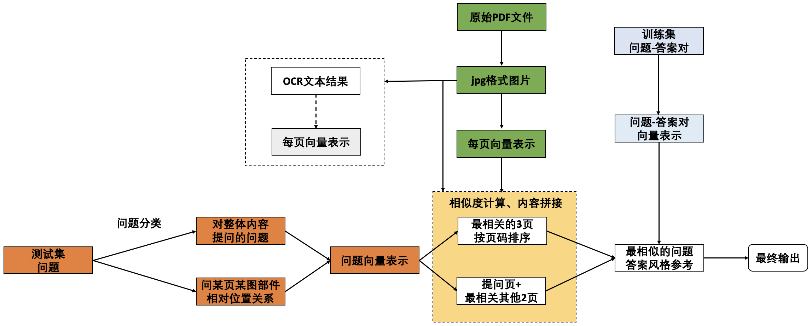

# ccks2025_pdf_multimodal
My implementation in TianChi CCKS 2025 pdf QA multimodal competition：https://tianchi.aliyun.com/competition/entrance/532357/information

------
初赛的在round_a里面比较乱

复赛的
0. 安装必要依赖和下载模型，通常pip install ms-swift然后用魔搭下载模型
1. 在round_b里面，可以先运行b_train_test_preprocess.py预处理，这个时间比较久
2. 然后运行"finetune训练集构造_v2.ipynb"构造训练集
3. train_vl.sh训练模型
4. test_b_style_refer_215.py获取结果

------
Full explanation can refer to Zhihu:
https://zhuanlan.zhihu.com/p/1937478905532506972
